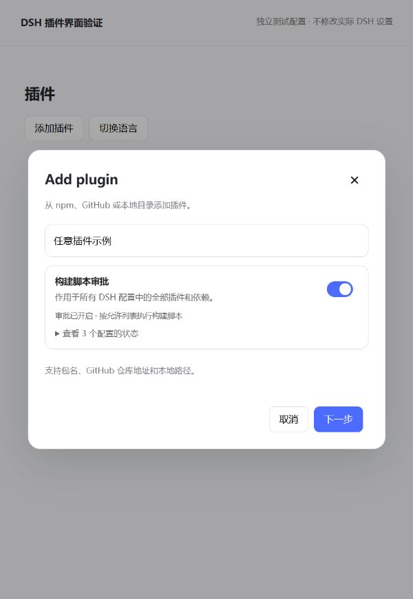
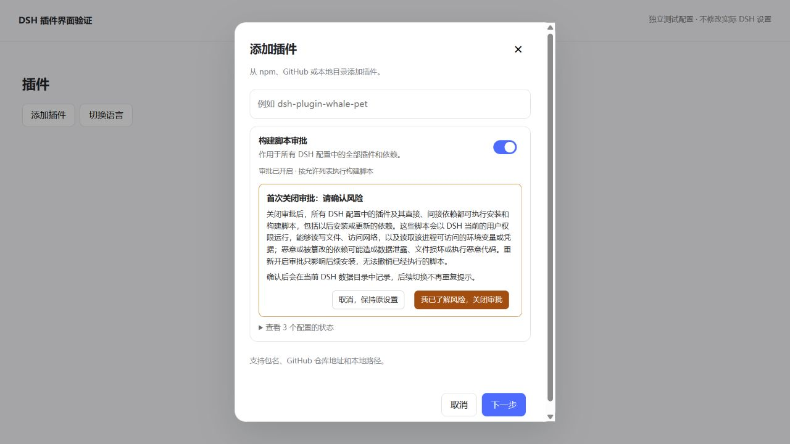

# DSH pnpm 构建审批开关

在 DeepSeek Harness 的 **插件 → 添加插件** 弹窗中，包名或地址输入框下方增加一个“构建脚本审批”开关。

- **开启**：所有 DSH 配置按各自原有的 `allowBuilds` 规则审批构建脚本。
- **关闭**：所有 DSH 配置允许全部依赖执行构建脚本，包括 GitHub 插件、新版本和间接依赖。
- **查看配置状态**：展开后查看 desktop、web、tui 及其他已创建配置的实际状态。

作用范围是当前 DSH_HOME 下的全部 DSH 配置，与具体安装哪个插件无关。每次切换直接保存，下次安装或更新时生效。

[下载安装包](https://github.com/Han-1413141/dsh-pnpm-build-control/releases/latest) · [更新记录](CHANGELOG.md) · [反馈问题](https://github.com/Han-1413141/dsh-pnpm-build-control/issues)

## 适用场景

### 开发者安装最新版本，测试新增功能

开发插件时，开发者需要反复安装刚发布的测试版本，或直接安装 GitHub 上的最新提交。当插件需要执行构建脚本，而允许列表只放行了某个版本或 Git 提交时，新版本、新提交的安装会被 pnpm 拦截。开发者因此需要指定已放行的版本，或重新查找并放行每次更新对应的版本、提交，才能继续测试。

本插件提供统一开关：关闭构建脚本审批后，所有 DSH 配置都允许依赖执行必要的安装和构建脚本，开发者无需再为构建审批逐个维护新版本、新提交的允许条目，可以继续安装最新代码、验证功能和调试问题。

### 用户体验插件的最新功能

用户按照插件作者的说明安装最新版本、测试版或 GitHub 版本时，也会遇到构建脚本被 pnpm 保护机制拦截的情况。例如，安装提示 `ERR_PNPM_GIT_DEP_PREPARE_NOT_ALLOWED` 或 `ERR_PNPM_IGNORED_BUILDS`，导致无法体验刚加入的功能。

用户可以在“添加插件”页面关闭构建脚本审批，阅读并确认首次风险说明后，重新执行安装或更新。该设置对所有插件及其依赖生效，无需针对每个插件单独编辑允许列表；需要恢复审批时，再打开开关即可。

这里解除的是**构建脚本审批限制**。实际安装哪个版本，仍由 DSH 插件管理器中的包版本、分支、标签或提交决定；已经固定到某个版本或提交的安装来源，需要更新来源才能获取最新代码。pnpm 的新版本发布等待时间等其他保护设置保持原值。

## 界面位置



上图来自本项目的独立预览页面，展示开关的位置。预览中的操作只修改测试配置。

## 安装

### 在 DSH 界面安装

打开 **插件 → 添加插件**，在包名或地址输入框填入：

```text
https://github.com/Han-1413141/dsh-pnpm-build-control
```

完成安装后重新打开“添加插件”。如果当前窗口尚未加载新插件，重启 DSH。

### 使用命令行安装

安装 GitHub 仓库的当前版本：

```powershell
dsh plugin --profile desktop add github:Han-1413141/dsh-pnpm-build-control
```

固定到当前发行版本：

```powershell
dsh plugin --profile desktop add github:Han-1413141/dsh-pnpm-build-control#v0.1.3
```

也可从 [Releases](https://github.com/Han-1413141/dsh-pnpm-build-control/releases) 下载 `.tgz` 安装包，再使用 PowerShell：

```powershell
dsh plugin --profile desktop add 'D:\Downloads\dsh-pnpm-build-control-0.1.3.tgz'
```

需要在 web 配置的界面中显示开关时，将上述命令中的 `desktop` 换为 `web`。任一已安装实例的开关都会控制同一个 DSH_HOME 下的所有配置。插件自身没有 `prepare`、`install` 或 `postinstall` 脚本，不需要先关闭审批才能安装。

仓库和发行包均包含编译后的 `lib/`，安装时无需现场构建。插件首次加载只读取现有状态；首次切换后保存统一策略。

**升级插件后，请完整退出并重新打开 DSH。** 如 DSH 仍驻留托盘，需要从托盘退出；仅刷新窗口或重新打开弹窗不会替换已经加载的后台模块。升级前请先结束需要保留的运行任务。

## 首次关闭的风险确认

第一次关闭审批时，开关下方会先显示风险说明。点击 **“我已了解风险，关闭审批”** 后才修改配置；点击“取消，保持原设置”或按 Escape，保留当前设置。

风险说明涵盖以下内容：

- 所有 DSH 配置中的插件及其直接、间接依赖，都可以执行安装和构建脚本，包括后续安装或更新的依赖。
- 脚本以 DSH 当前的用户权限运行，能够读写文件、访问网络，以及读取该进程可访问的环境变量或凭据。
- 恶意或被篡改的依赖可能造成数据泄露、文件损坏或执行恶意代码。
- 重新开启审批只影响后续安装，无法撤销已经执行的脚本。

确认记录保存在同一 `DSH_HOME` 的插件状态文件中。后续切换、重启和使用其他 profile 时不重复提示；独立的 `DSH_HOME` 分别确认。升级前已经关闭审批的设置会保留，但不会自动记为已确认风险。



## 配置行为

插件修改各配置目录中的 `pnpm-workspace.yaml`：

```yaml
# 关闭构建脚本审批
dangerouslyAllowAllBuilds: true
```

重新开启审批时，字段变为 `false`。原有 `allowBuilds` 条目和其他配置会保留。pnpm 的发布等待时间、证书校验等设置保持原有值。如果某个配置另设了 `ignoreScripts: true`，界面会显示提示，脚本仍会被该设置禁用。

每次改写前自动保存相关 YAML 文件的原始内容，备份位置为：

```text
DSH_HOME/pnpm-build-control/backups/<时间与标识>/
```

统一策略保存在 `DSH_HOME/pnpm-build-control/state.json`。默认 DSH_HOME 为用户目录下的 `.dsh`；支持 DSH 自定义的数据目录。

插件只处理 `DSH_HOME/profiles` 下具有 DSH 配置声明的目录，不修改系统 pnpm 全局配置或 DSH 之外的项目。

插件运行时监测配置目录，对新建配置及被重新生成的配置文件应用当前策略。应用关闭期间，已保存的设置继续有效；新建配置会在插件下次启动后应用统一策略。切换时遇到损坏的 YAML 会报告具体配置，不把部分成功显示成全部成功。

## 命令行开关

没有打开 DSH 界面时，可以直接运行已安装插件的 CLI。以下为 Windows PowerShell 示例，需要 Node.js 22.19 或更高版本：

```powershell
# 查看所有 DSH 配置
node "$env:USERPROFILE\.dsh\profiles\desktop\node_modules\dsh-pnpm-build-control\lib\cli.js" status

# 关闭审批，允许所有依赖构建
node "$env:USERPROFILE\.dsh\profiles\desktop\node_modules\dsh-pnpm-build-control\lib\cli.js" off

# 重新开启审批
node "$env:USERPROFILE\.dsh\profiles\desktop\node_modules\dsh-pnpm-build-control\lib\cli.js" on
```

可追加 `--home '自定义DSH目录'`。CLI 的 `on` 表示开启审批，`off` 表示关闭审批。

**首次执行 `off` 会输出风险说明并保持原设置。** 阅读并接受风险后，添加 `--accept-risk` 再执行：

```powershell
node "$env:USERPROFILE\.dsh\profiles\desktop\node_modules\dsh-pnpm-build-control\lib\cli.js" off --accept-risk
```

CLI 与界面共用确认记录。已经确认后，普通 `off` 可以直接执行。

## 恢复与卸载

要恢复审批，在界面开启开关或执行 CLI 的 `on`。原有 `allowBuilds` 条目会重新生效。

卸载插件不会自动撤销已保存的 pnpm 设置。如果希望卸载后继续审批，先开启审批，再通过 DSH 插件管理器卸载本插件。

若需要从备份恢复完整 YAML，先停用或卸载插件，再恢复对应文件。重新启用前可移走 `state.json`，使插件恢复为只读取现有设置的首次加载行为；这也会清除风险确认记录。

## 常见问题

**启用插件后重启提示 `desktop welcome: Web RPC failed`**：请升级至 0.1.3 或更新版本。旧版本手动注册的 Typert 接口与 DSH 自动注册发生冲突，使内置设置接口被撤销，导致桌面启动失败。0.1.3 已移除手动注册。无法进入界面时，可在终端运行上面的安装命令升级，再点击错误窗口中的“Restart”。

如果此前使用了故障窗口中的“Disable third-party plugins, back up profile patch, and restart”，DSH 会以停用第三方插件的配置启动。升级安装包不会自动恢复这些插件的启用状态；请在插件管理中重新启用本插件，再完整退出并打开 DSH。

**点击确认后提示 `Unrecognized key: "acknowledgeRisk"`**：界面已经更新，后台仍在运行 0.1.0 的旧模块。完整退出 DSH（包括托盘驻留）后重新打开即可加载已安装的新后端。0.1.2 起会在切换前识别这种情况，显示明确的重启提示；不会删除确认字段重试。

**添加插件弹窗没有开关**：确认本插件在当前窗口使用的 profile 中已启用，再重启 DSH。后续 DSH 版本若调整表单结构，需要同步更新界面适配。

**关闭后仍然报错**：展开配置状态，确认目标配置显示“审批已关闭”，并查看 `ignoreScripts` 提示。本插件处理 `ERR_PNPM_GIT_DEP_PREPARE_NOT_ALLOWED` 和 `ERR_PNPM_IGNORED_BUILDS` 所对应的构建审批。网络、认证、依赖版本解析及构建脚本本身失败，需要按具体错误处理。

**出现 `${NPM_TOKEN}` 警告**：这是 npm 配置中的环境变量未替换。切换构建审批不会填写或修改认证信息。

**重新开启后某个包仍能构建**：该包可能已经在原有允许列表中。开关恢复原有审批规则，不清空已有授权。

## 界面与兼容性

在 Windows 上按 **DSH 0.2.0-rc.2 / 内置 pnpm 11.7.0** 实现并验证。其他 DSH 版本和操作系统尚未完成集成验证。当前版本的“添加插件”弹窗没有专用扩展插槽，插件通过 `shell.overlay` 管理组件，在安装表单的明确挂载位置显示开关；关闭表单或卸载插件时移除组件。

没有修改 DSH 的应用安装文件。界面识别支持中文和英文安装输入框。DSH 若在后续版本调整该弹窗的结构或标签，插件界面适配需要同步更新；配置开关和 CLI 不依赖弹窗结构。

## 开发与验证

```powershell
git clone https://github.com/Han-1413141/dsh-pnpm-build-control.git
cd dsh-pnpm-build-control
npm ci --ignore-scripts --no-audit --no-fund
npm run build
npm test
npm run preview
```

`npm run preview` 仅监听 `127.0.0.1`，启动后打印访问地址，在项目 `.preview/` 中创建独立测试配置。切换不会修改实际 DSH 设置。

`npm run preview -- --legacy-host` 可模拟新界面连接旧后台，查看重启提示。

已执行的验证：

1. 15 项测试：11 项配置与 CLI 测试，加上旧后台识别、兼容后台请求、截图错误复现及错误提示的 4 项回归测试。
2. 本机 DSH 的真实 Cordis、Typert Loader、Registry 和 Gateway：插件挂载、状态读取、关闭、开启，以及非法请求拦截。
3. DSH 内置 pnpm 的实际安装：审批开启时测试脚本被拦截；关闭时执行成功；再次开启后新测试包的脚本重新被拦截。
4. 浏览器中的安装弹窗测试：开关挂载、状态切换、输入框重新渲染、离开表单后清理、首次取消保持原设置、确认后切换，以及页面重载后不重复提示。

0.1.3 增加完整 DSH 启动回归测试：在独立 `DSH_HOME` 中通过真实 CLI 启动基础配置、Web 应用和本插件，再调用桌面启动必需的 `settings/describe` 与 `llm/listConfigurableProviders`，以及本插件的查询和开关接口。单独加载插件的测试无法覆盖自动接口注册冲突。

开发时设置 `DSH_CLI_ENTRY` 为 DSH 的 CLI JavaScript 入口；使用 Electron 内置运行时还需将 `DSH_EXECUTABLE` 设置为对应可执行文件。然后运行 `npm run test:startup`。测试只启动本地后端，使用独立临时配置，不打开窗口或读取真实会话。

上述浏览器验证使用了与本机 DSH 安装表单相同的关键 DOM 结构。正在运行的 DSH 桌面窗口中的最终显示仍需加载新插件后查看。

配置依据：[pnpm 官方文档：dangerouslyAllowAllBuilds](https://pnpm.io/settings/build#dangerouslyallowallbuilds)。

源码中，`src/core.js` 负责配置管理，`src/index.ts` 和 `src/typert.js` 负责宿主接口，`src/client.jsx` 提供界面，`src/risk.js` 保存共用的风险说明，`src/cli.js` 提供命令行入口。

发布前执行 `npm run build` 和 `npm test`，提交生成的 `lib/`，再使用 `npm pack --ignore-scripts` 生成发行包。

## 许可证

使用 [MIT License](LICENSE)。
